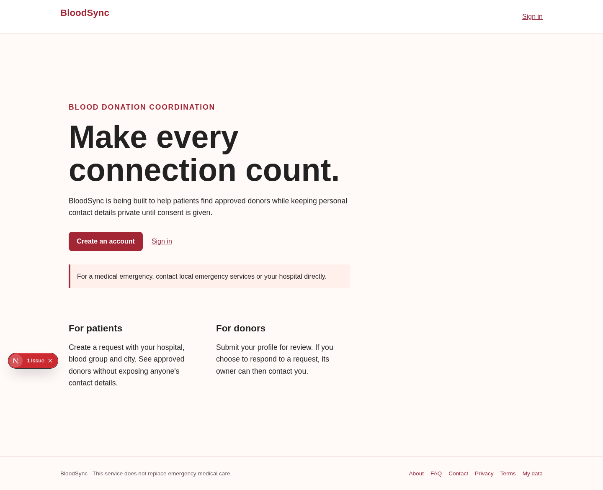
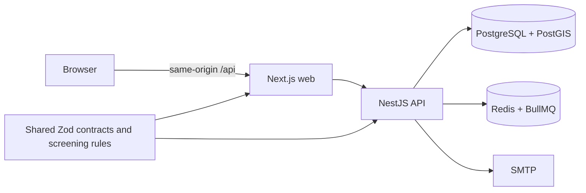

# BloodSync

Open-source blood donation coordination software by **Atanu Bera**. The reference project informed the feature map; no reference source was copied.

**Status:** Phases 1–6 source work and a polish pass are implemented. This is a prototype and **must not be used with real patient or donor data**. Clinical, legal, independent security, backup/recovery and production deployment reviews remain unverified. See the [phase audits](docs/PHASE6_AUDIT.md).

[Mobile screenshot](apps/web/public/screenshots/home-320.png)

## What works

- Account signup, email verification, sign-in, rotating refresh sessions, password reset and account lockout.
- Patient-owned requests with expiry, approved donor profiles and nearby, redacted matching.
- Donor interest with current, explicit contact-sharing consent, administrator approval and audit events.
- Account data export, password-confirmed deletion and consent withdrawal.

Bank inventory, queued email alerts and SSE alerts are deferred to v2. BloodSync does not give medical advice or confirm donor eligibility or blood compatibility.

## Five-minute local setup

Requirements: Node 24, pnpm 11, Docker Compose.

1. Copy `.env.example` to `.env` and replace `SESSION_SECRET` with a random value of at least 32 characters. Never commit `.env`.
2. Run `docker compose up -d`.
3. Run `pnpm install && pnpm db:generate && pnpm db:migrate`.
4. Run `pnpm dev`; the root command loads `.env` for both apps.
5. Open `http://localhost:3000`. Verification and reset messages appear in Mailpit at `http://localhost:8025`. API liveness and readiness are at `/health/live` and `/health/ready`; the API is versioned under `/v1`, with OpenAPI documentation at `/v1/docs`.

The Compose database credentials are for local development only. The web app proxies `/api` to `API_ORIGIN` so the browser and API cookies share one host. A non-Vercel production build requires explicit HTTPS `API_ORIGIN` and `SITE_URL`; the API requires a non-local `SMTP_HOST` and `MAIL_FROM`. The Vercel configuration uses two Services, Vercel Queues for account email, and a daily Cron for request expiry; see [the Vercel deployment guide](docs/VERCEL_DEPLOYMENT.md). Set `TRUST_PROXY_HOPS` to the exact number of trusted reverse proxies between the client and API: use `1` only for a topology with one proxy, such as a dedicated Next.js proxy, and `0` for direct connections. Block direct public access to the API when trusting forwarded IP headers. The API warns at startup if production uses `0`; this is a prompt to verify the topology, not a reason to guess a hop count.

## Architecture

`apps/web` contains the Next.js UI and same-origin proxy. `apps/api` enforces roles, ownership, consent, rate limits and CSRF. `packages/shared` contains contracts and configurable screening defaults. Locally, request expiry and account email jobs run through BullMQ. On Vercel, Cron expires requests daily and Vercel Queues dispatches account email. Matching uses indexed PostGIS geography expressions and a 50 km radius with a same-city fallback. No public donor contact endpoint exists.

## Checks and operations

Run `pnpm lint`, `pnpm format:check`, `pnpm typecheck`, `pnpm test`, `pnpm build`, and `bash scripts/run-integration.sh` with PostGIS, Redis and Mailpit running. The integration script uses synthetic accounts. `scripts/browser-check.mjs` and `scripts/browser-auth-check.mjs` use a locally installed Chromium and a running web/API stack; see [RUNBOOK.md](RUNBOOK.md) for operations. Do not run browser checks against real accounts.

To provision an administrator, verify an account first, then run `pnpm --filter @bloodsync/api admin:provision person@example.com` from a trusted operator shell. There is no public admin signup path.

## Donor screening and privacy

Defaults in `packages/shared/src/eligibility.ts`: age **18–65 years**, minimum weight **45 kg**, and at least **90 days** since the last donation. The owner identified 45 kg in the reference donor guidance; its README says 50 kg. See [the plan](docs/PLAN.md). A qualified local clinician must approve local thresholds and workflows before real use. Hospitals must confirm red-cell compatibility and donor eligibility.

Donor contact details are shown to a request owner only after that donor expresses interest with active consent for the current privacy version. Coordinates are rounded to two decimal places before storage. Withdrawing consent stops matching and removes interests. Account deletion cascades owned data and sessions; only anonymous audit event type, time and result remain. A local legal reviewer must set a retention policy before real use.

Signup keeps the generic duplicate-email `400` response, “Unable to create account with these details”. This avoids a direct account lookup message while telling the caller that signup failed; returning success for an account that was not created would be misleading. If the account is created but email queuing fails, signup still succeeds and the user can request a fresh link on the verification page. Password reset and verification requests enqueue the same job for existing and missing accounts and return a generic response. Email delivery can still reveal an account to someone who controls its mailbox, so rate limits apply.

## Roadmap and contribution

- Device, offline and representative load validation on a production-like deployment.
- Verify a real canonical domain, crawler rendering, and qualified local content before indexing city or blood-group landing pages.
- Rehearse backups and incident response, then obtain independent security and clinical reviews before any real-world launch.
- v2: blood bank inventory, queued email alerts and SSE alerts.

Read [CONTRIBUTING.md](CONTRIBUTING.md), [SECURITY.md](SECURITY.md), [CHANGELOG.md](CHANGELOG.md) and the [MIT license](LICENSE). Never submit real health data in issues or tests.
