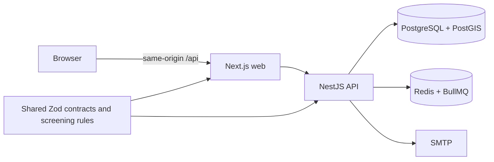

# BloodSync

Open-source blood donation coordination software by **Atanu Bera**. The reference project informed the feature map; no reference source was copied.

**Status:** Phases 1–3 MVP code has local API and browser checks. This is a prototype and **must not be used with real patient or donor data**. Clinical, legal, independent security, backup/recovery and production deployment reviews remain unverified. See the [phase audits](docs/PHASE3_AUDIT.md).

[Mobile screenshot](apps/web/public/screenshots/home-320.png)

## What works

- Account signup, email verification, sign-in, rotating refresh sessions, password reset and account lockout.
- Patient-owned requests with expiry, approved donor profiles and nearby, redacted matching.
- Donor interest with current, explicit contact-sharing consent, administrator approval and audit events.
- Account data export, password-confirmed deletion and consent withdrawal.

Bank inventory, queued email alerts and SSE alerts are deferred to v2. BloodSync does not give medical advice or confirm donor eligibility or blood compatibility.

## Five-minute local setup

Requirements: Node 24, pnpm 11, Docker Compose.

1. Copy `.env.example` to `.env` and replace `SESSION_SECRET` with a random value of at least 32 characters. Never commit `.env`.
2. Run `docker compose up -d`.
3. Run `pnpm install && pnpm db:generate && pnpm db:migrate`.
4. Export the `.env` values to your shell, then run `pnpm dev`.
5. Open `http://localhost:3000`. Verification and reset messages appear in Mailpit at `http://localhost:8025`. The API health route is `http://localhost:4000/health`.

The Compose database credentials are for local development only. The web app proxies `/api` to `API_ORIGIN` so the browser and API cookies share one host. A production build requires an explicit HTTPS `API_ORIGIN`. Set `SITE_URL` to the real canonical web origin for deployment. Production domain, CORS, secrets and SMTP settings must be reviewed before use. `TRUST_PROXY_HOPS=1` trusts the one local Next.js proxy; in production set it to the actual trusted hop count and block direct public access to the API to prevent forged client IP headers bypassing rate limits.

## Architecture

`apps/web` contains the Next.js UI and same-origin proxy. `apps/api` enforces roles, ownership, consent, rate limits and CSRF. `packages/shared` contains contracts and configurable screening defaults. The request-expiry worker runs through BullMQ. Matching uses indexed PostGIS geography expressions and a 50 km radius with a same-city fallback. No public donor contact endpoint exists.

## Checks and operations

Run `pnpm lint`, `pnpm format:check`, `pnpm typecheck`, `pnpm test`, `pnpm build`, and `bash scripts/run-integration.sh` with PostGIS, Redis and Mailpit running. The integration script uses synthetic accounts. `scripts/browser-check.mjs` and `scripts/browser-auth-check.mjs` use a locally installed Chromium and a running web/API stack; see [RUNBOOK.md](RUNBOOK.md) for operations. Do not run browser checks against real accounts.

To provision an administrator, verify an account first, then run `pnpm --filter @bloodsync/api admin:provision person@example.com` from a trusted operator shell. There is no public admin signup path.

## Donor screening and privacy

Defaults in `packages/shared/src/eligibility.ts`: age **18–65 years**, minimum weight **45 kg**, and at least **90 days** since the last donation. The owner identified 45 kg in the reference donor guidance; its README says 50 kg. See [the plan](docs/PLAN.md). A qualified local clinician must approve local thresholds and workflows before real use. Hospitals must confirm red-cell compatibility and donor eligibility.

Donor contact details are shown to a request owner only after that donor expresses interest with active consent for the current privacy version. Coordinates are rounded to two decimal places before storage. Withdrawing consent stops matching and removes interests. Account deletion cascades owned data and sessions; only anonymous audit event type, time and result remain. A local legal reviewer must set a retention policy before real use.

Signup uses the generic duplicate-email response “Unable to create account with these details” to avoid direct account lookup. Password reset and verification request responses are generic for the same reason. Timing and email delivery can still leak information indirectly, so rate limits apply.

## Roadmap and contribution

- Phase 4: continue device, offline and performance validation on production-like deployments.
- Phase 5: verify a real canonical domain, search engine rendering, and qualified local content before indexing city or blood-group landing pages.
- Phase 6: rehearse backups, incident response and independent security/clinical reviews before any real-world launch.
- v2: blood bank inventory, queued email alerts and SSE alerts.

Read [CONTRIBUTING.md](CONTRIBUTING.md), [SECURITY.md](SECURITY.md), [CHANGELOG.md](CHANGELOG.md) and the [MIT license](LICENSE). Never submit real health data in issues or tests.
